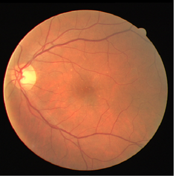
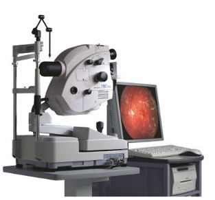

## ⭐ Video-based

Existing methods for retinal vessel segmentation are designed on image-based datasets. Although these datasets have contributed valuable vessel annotations for studying retinal segmentation, the static nature of images inherently limits their ability to portray dynamic retinal characteristics, e.g., vessel pulsations. These dynamic phenomena play a vital role in facilitating comprehensive and in-depth understanding of retinal functionality and vasculature structure.

The sequential frames in our RVD dataset capture the continuous changes in retinal vessels and thus significantly facilitate the analysis of subtle fluctuations in the retinal structure.

<head>
    
</head>
<body>
    

        

            
            
Image-based Data

        

        

            
            
Video-based Data

        

    

</body>

## ⭐ Hand-held

In recent years, advances in imaging technology have enabled the usage of smartphone-based devices for retinal observation. They offer better flexibility and portability, allowing for scalable data collection. 
However, existing image-based datasets are captured by expensive bench-top ophthalmic equipment, which is operated by professionally trained clinicians. 
Such requirements potentially limit the scale of the datasets and data diversity, thereby adversely affecting the generalization ability of the models trained on these datasets.

 

Therefore, the provision of the video modality and the use of portable devices for data acquisition and remarkably overcome the limitations of existing datasets.
To the best of our knowledge, RVD is the first mobile-device based and video based dataset for retinal vessel segmentation.

<head>
    
</head>
<body>
    

        

            
            
Bench-top Device

        

        

            
            
Handheld Device

        

    

</body>

